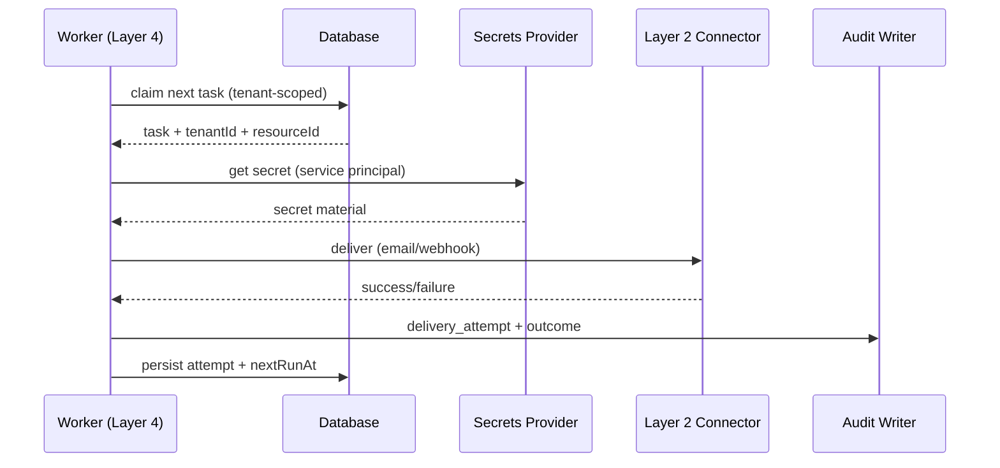

# Layer 4 (Platform Core) — Security Design (RBAC-first)

Status: Draft

> Note: a curated and summarized version of this design has been moved to `docs/Layer4-PlatformCoreLayer/Security-Foundation.md` for operational docs and verification materials.

This document defines the **Layer 4 security foundation** that gates every layer (API, workers, resources, and audit).

Context:
- **Phase 10** is the current workstream (Production Readiness & Enterprise Features).
- **Layer 4 (Platform Core)** is the architecture layer that hosts orchestration, security enforcement, resource/secret governance, and audit.

Implementation is intended to be incremental, starting with **tenant isolation + RBAC + audit logging**, then expanding to stronger enterprise hardening.

Related documents:
- [docs/design/security-foundation-plan.md](docs/design/security-foundation-plan.md)
- [docs/design/phase1a-architecture.md](docs/design/phase1a-architecture.md)
- [docs/design/phase1a-evolution-resources.md](docs/design/phase1a-evolution-resources.md)

---

## Goals
- Enforce **tenant isolation** across all API reads/writes.
- Provide **RBAC** that is simple enough to ship, but extensible.
- Make all high-value actions **auditable** with immutable, queryable events.
- Ensure secrets are **never stored in plaintext** and all secret access is audited.
- Define enforcement points for:
  - HTTP API handlers
  - worker/queue execution
  - resource resolution (connector credentials)

## Non-goals (for this design pass)
- Implement Layer 3 mapper features (paused).
- Full enterprise SSO/MFA implementation (design hooks only).
- Full policy-as-code engine (start with role checks + explicit permissions).

---

## Core concepts

### Principal
A **principal** is the authenticated identity making a request.

Principal types:
- `user`: a human user (browser or API)
- `service`: internal service account (worker, automation)
- `api_key`: long-lived key used by integrations (optional; can be deferred)

### Tenant
A **tenant** is the unit of isolation. Every business object is tenant-scoped unless explicitly global.

Tenant-scoped objects (initial):
- Users (membership in a tenant)
- Bridges
- Resources
- Jobs / Tasks / Transactions
- Audit events

Global objects (allowed, tightly controlled):
- System configuration
- Platform operators/admins

### Role vs permission
- **Roles** are human-friendly bundles (Admin/Developer/Viewer/Operator).
- **Permissions** are the actual checks enforced in code.

This design starts with role checks, but defines permissions so we can evolve toward a granular model without refactoring every endpoint.

---

## Authentication (AuthN)

### Current baseline in repo
The API already supports:
- JWT tokens via `@fastify/jwt`
- Cookie-based sessions (httpOnly `token` cookie)
- Bearer tokens via `Authorization: Bearer <token>`

Layer 4 requirement: every authenticated request results in a normalized `request.principal` object:

```json
{
  "type": "user",
  "userId": "...",
  "tenantId": "...",
  "roles": ["tenant_admin"],
  "scopes": ["bridges:write", "resources:read"],
  "auth": { "method": "cookie" }
}
```

### Token contents (minimum)
- `sub` or `userId`
- `tenantId` (selected tenant; see multi-tenant UX below)
- `roles` (tenant role + optional operator role)
- `iat`, `exp`

### Multi-tenant UX (selection)
If a user belongs to multiple tenants:
- browser session selects an active `tenantId` (stored server-side or in token)
- API requires explicit tenant context for tenant-scoped endpoints

Simplest MVP: require one tenant per user initially; later add membership + tenant switcher.

---

## Authorization (AuthZ)

### Enforcement points
1. **HTTP request preHandler**
   - Verify principal
   - Resolve tenant context
   - Check permission

2. **DB access layer**
   - Always include `tenantId` in WHERE clause for tenant-scoped objects
   - Never “fetch then filter” in memory

3. **Worker execution**
   - Workers act as `service` principals
   - A worker must only process jobs/tasks for a tenant and must emit audit events

4. **Resource/secret access**
   - Any `getSecret(...)` requires a principal and emits audit

### Roles (initial)
Tenant roles:
- `tenant_admin`: full tenant control
- `tenant_developer`: can create/update bridges/resources, view logs
- `tenant_viewer`: read-only views
- `tenant_auditor`: read-only + audit log access

Platform roles:
- `operator`: can support tenants, validate resources
- `platform_admin`: full system control

### Permission catalog (initial)
This is the smallest stable set that maps cleanly to endpoints.

- `users:read`, `users:write`
- `roles:read`, `roles:write`
- `bridges:read`, `bridges:write`, `bridges:delete`, `bridges:test`
- `resources:read`, `resources:write`, `resources:validate`
- `jobs:read`, `jobs:write`, `jobs:retry`, `jobs:cancel`
- `transactions:read`, `transactions:retry`
- `audit:read`, `audit:write`
- `secrets:read` (never exposed directly to tenant users; used by services)

### Role → permissions mapping (MVP)
| Permission | tenant_admin | tenant_developer | tenant_viewer | tenant_auditor | operator | platform_admin |
| --- | --- | --- | --- | --- | --- | --- |
| users:read | ✓ | ✓ | ✗ | ✓ | ✓ | ✓ |
| users:write | ✓ | ✗ | ✗ | ✗ | ✓ (tenant-limited) | ✓ |
| bridges:read | ✓ | ✓ | ✓ | ✓ | ✓ | ✓ |
| bridges:write | ✓ | ✓ | ✗ | ✗ | ✓ | ✓ |
| bridges:delete | ✓ | ✗ | ✗ | ✗ | ✓ | ✓ |
| bridges:test | ✓ | ✓ | ✗ | ✗ | ✓ | ✓ |
| resources:read | ✓ | ✓ | ✓ | ✓ | ✓ | ✓ |
| resources:write | ✓ | ✓ | ✗ | ✗ | ✓ | ✓ |
| resources:validate | ✓ | ✗ | ✗ | ✗ | ✓ | ✓ |
| jobs:read | ✓ | ✓ | ✓ | ✓ | ✓ | ✓ |
| jobs:write | ✓ | ✓ | ✗ | ✗ | ✓ | ✓ |
| jobs:retry | ✓ | ✓ | ✗ | ✗ | ✓ | ✓ |
| transactions:read | ✓ | ✓ | ✓ | ✓ | ✓ | ✓ |
| transactions:retry | ✓ | ✓ | ✗ | ✗ | ✓ | ✓ |
| audit:read | ✓ | ✓ | ✗ | ✓ | ✓ | ✓ |
| audit:write | (internal) | (internal) | (internal) | (internal) | ✓ | ✓ |
| secrets:read | ✗ | ✗ | ✗ | ✗ | ✓ (break-glass) | ✓ |

Notes:
- “internal” means only services/worker write audit; user-facing endpoints do not write directly.
- `secrets:read` should not grant raw secret material to humans by default; prefer “test resource” operations.

---

## Data model (proposed)

This is a design-only proposal to enable tenant isolation + RBAC.

### Tenant
- `Tenant { id, name, status, createdAt }`

### Membership
- `TenantMembership { id, tenantId, userId, role, createdAt }`

### Audit event
Either extend `AuditLog` or add an append-only `AuditEvent` table.

Minimum fields:
- `id`
- `tenantId` (nullable for platform events)
- `actorType` (`user`|`service`|`operator`)
- `actorId`
- `action` (string enum-ish)
- `targetType`, `targetId`
- `meta` (JSON)
- `createdAt`

---

## Audit logging (who/what/when)

### Events (initial)
Tenant-scoped:
- `user.invite`, `user.role_changed`, `user.removed`
- `bridge.created`, `bridge.updated`, `bridge.deleted`, `bridge.tested`
- `resource.created`, `resource.updated`, `resource.validated`
- `job.created`, `job.retried`, `job.cancelled`

System/platform:
- `operator.impersonation_started`, `operator.impersonation_ended`
- `secret.accessed` (always)

### Immutable write path
- Audit writes must not be “best effort logs”; they are part of the platform contract.
- If audit write fails for a high-value action, default to **fail closed** (block the action) unless explicitly marked low-risk.

---

## Secrets management

### Rules
- No plaintext secrets in DB (`secret_id` pointers only).
- Secret reads must be attributed to a principal and audited.
- Prefer “capability endpoints” over “show secret” (e.g., validate webhook).

### Interfaces
Introduce a Layer 4 interface:
- `secrets.get(secretId, principal)`
- `secrets.put(secretId, value, principal)`

---

## Cross-layer interaction diagrams

### API request auth + authz
```mermaid
sequenceDiagram
  participant Browser
  participant API as API Server (Layer 4)
  participant Auth as AuthN/AuthZ Middleware
  participant DB as Database
  participant Audit as Audit Writer

  Browser->>API: HTTP request (cookie or Bearer token)
  API->>Auth: verify token; build principal
  Auth->>Auth: check permission + tenant context
  Auth->>DB: query/update with tenantId filter
  DB-->>Auth: result
  Auth->>Audit: append audit event (actor/tenant/action/target)
  Audit-->>Auth: ok
  Auth-->>Browser: 200 / 403
```

### Worker job execution


---

## “Lock down” strategy (minimum viable)

Phase 1: Protect everything behind auth
- Require `authMiddleware` for all `/api/*` except:
  - `/api/auth/login`, `/api/auth/register`
  - `/health` and `/.well-known/health`
  - public inbound webhook endpoints (must use per-bridge auth)

Phase 2: Tenant isolation everywhere
- Add `tenantId` to tenant-scoped models.
- Change API queries to scope by `tenantId`.

Phase 3: RBAC enforcement
- Add a small `requirePermission(permission)` helper.
- Attach required permissions per route.

Phase 4: Operator workflows
- Add operator-only endpoints for validating resources and support.

---

## Rollout flags (implemented)

Environment variables used by the current implementation:
- `REQUIRE_AUTH=true|false`
  - When `true`, API endpoints wired with `requireAuthIfEnabled()` require a valid JWT (cookie or Bearer).
- `LOCKDOWN_JOBS=true|false`
  - When `true`, all `/api/jobs*` endpoints require authentication (high-value target protection).
  - Takes precedence over `REQUIRE_AUTH` for job endpoints specifically.
  - Dev verification: use `scripts/start-secure-dev.ps1` (Windows) or run `cross-env LOCKDOWN_JOBS=true REQUIRE_AUTH=true ENFORCE_RBAC=true pnpm run api:start` and then `node scripts/create-dev-users.mjs` to provision test accounts.
- `ENFORCE_RBAC=true|false`
  - When `true`, `requirePermission('...')` actively enforces permissions and returns 403 on violations.
- `SUPER_ADMINS=email1,email2`
  - Users with matching email are issued `isSuperAdmin=true` in JWT and bypass organization membership checks.

Notes:
- Audit visibility (`GET /api/audit`) is always protected by auth middleware.
- Recommended rollout: `LOCKDOWN_JOBS=true` first, then `REQUIRE_AUTH=true` for full coverage.


## Dev verification steps

1. Start secure dev API (Windows):

   ```powershell
   ./scripts/start-secure-dev.ps1
   ```

   or cross-platform:

   ```bash
   cross-env LOCKDOWN_JOBS=true REQUIRE_AUTH=true ENFORCE_RBAC=true pnpm run api:start
   ```

2. Provision test accounts (run while server is running):

   ```bash
   node scripts/create-dev-users.mjs
   ```

3. Run the in-process verification script to validate lockdown and audit:

   ```bash
   node scripts/verify-job-lockdown.mjs
   ```

   Expected basic outputs:
   - Unauthenticated POST /api/jobs -> 401
   - Regular user can create job with token -> 201
   - Regular user cannot run worker -> 403
   - Operator can run worker -> 200
   - Audit events present for job actions

4. If all checks pass, proceed to schedule CTO verification session and optionally enable `REQUIRE_AUTH=true` globally.

---

## Open questions (for CTO alignment)
- Tenant model: one-tenant-per-user initially vs membership now?
- Do we need `tenant_auditor` as a first-class role immediately?
- Operator access: do we allow “impersonation” or only scoped support actions?
