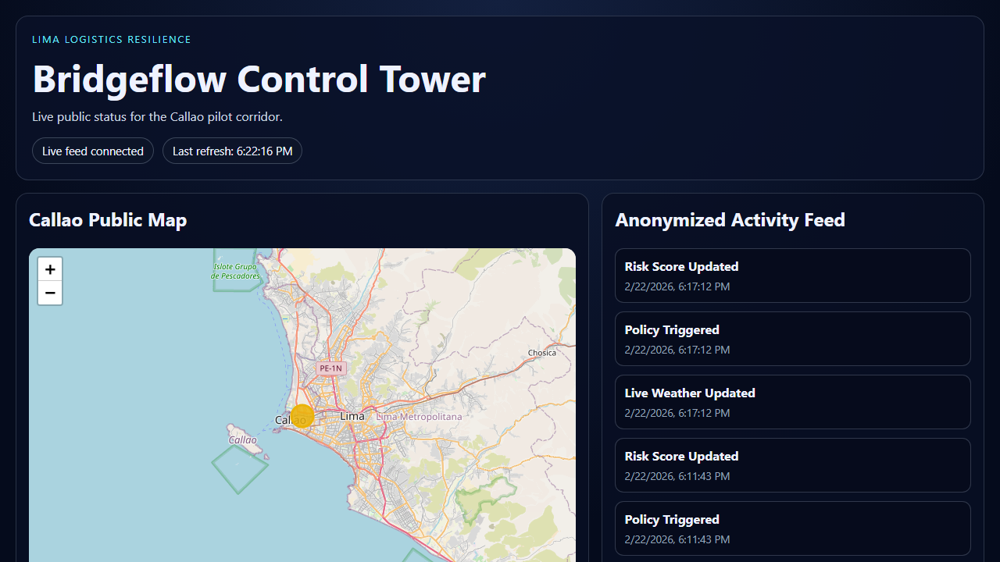

# Bridgeflow: The Policy-First Logistics Runtime

Bridgeflow is a policy enforcement layer for logistics operations.  
Core model: **Event -> Policy -> Action**.

Teams keep their ERP/WMS/TMS systems, while Bridgeflow ingests operational signals, evaluates policy, and coordinates action automatically.

## 1. Live Products

### Control Tower (Live Pilot)

See the Lima/Callao pilot in production:

- Product docs: `products/control-tower/`
- Live demo: [control-tower.up.railway.app](https://control-tower.up.railway.app/)

Other product repos in workspace:
- `products/carrier-portal/`
- `products/tracking-portal/`

## 2. Platform Stack

Bridgeflow products are powered by a modular service layer.

### Service Layer (Core Services and Modules)

- Auth and tenancy: `platform/bf-identity/`
- Master data: `platform/bf-masterdata/`
- Orders: `platform/bf-orders/`
- Shipments: `platform/bf-shipments/`
- Search: `platform/bf-search/`
- Fintech and billing: `platform/bf-fintech/`
- Warehouse operations: `platform/bf-warehouse/`
- Internal operations console: `platform/bf-admin-console/`

### Stack Relationship

- Products (customer-facing):
  - Control Tower, Carrier Portal, Tracking Portal
- Platform (powering services):
  - Identity, Masterdata, Orders, Shipments, Search, Fintech, Warehouse, Admin Console

## 3. Future Vision

Bridgeflow's long-term architecture is preserved in the BF-INTEGRATION vision archive:

- Vision deep dive: `vision/bf-integration/`
- Vision index and migration map: `vision/`

## 4. Developer Hub

Start integrating without choosing a product first:

- API reference hub: `api-reference/`
- Integration guide: `products/control-tower/integration-guide/`
- First event quickstart: `products/control-tower/quickstart/`

